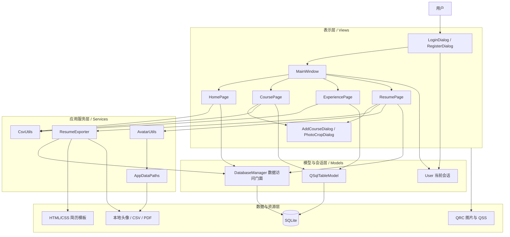
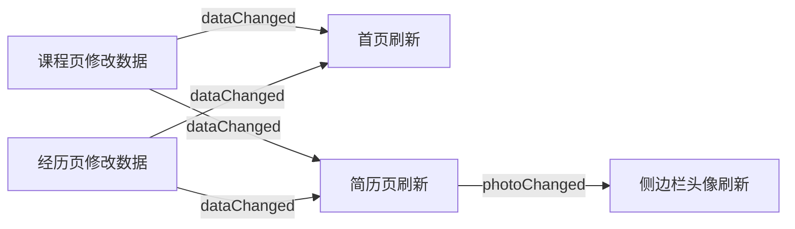
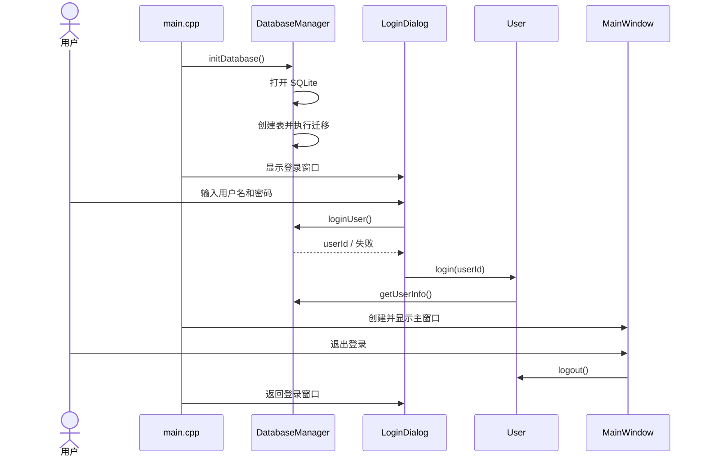
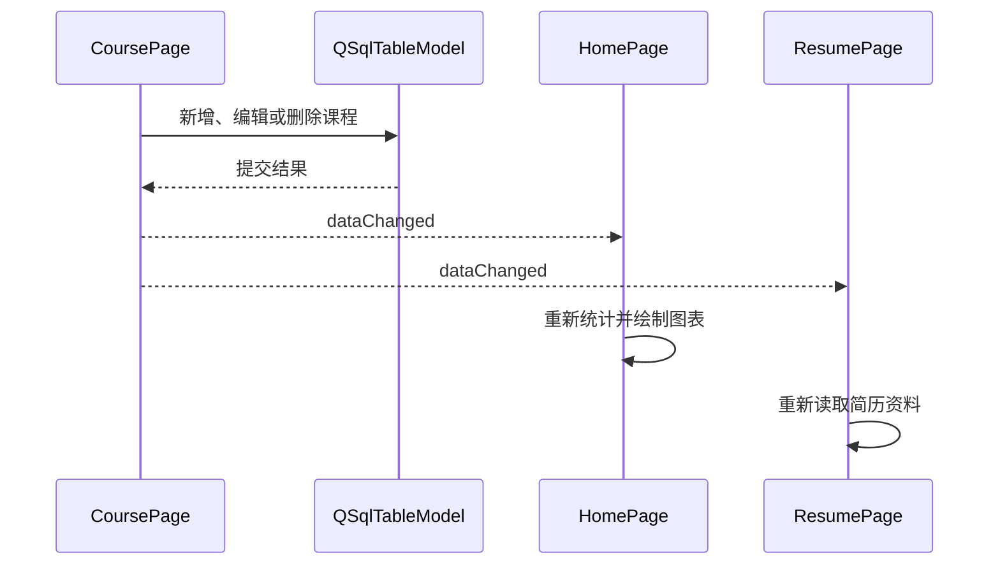
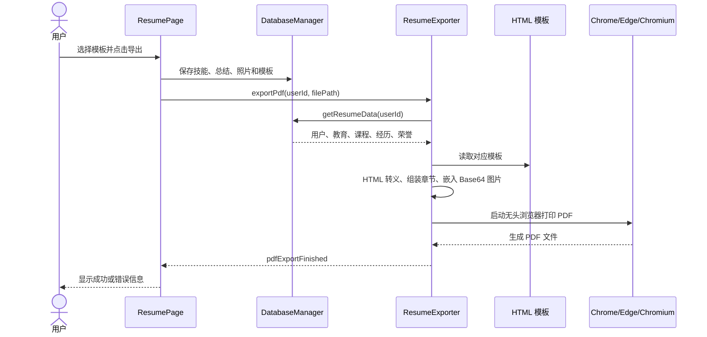
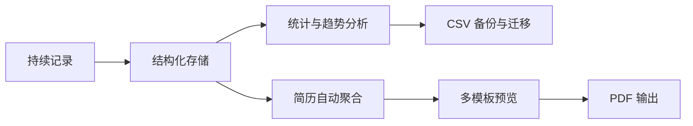

# College Tracker 项目展示说明

> 一款面向大学生的本地化成长档案管理与简历生成桌面应用  
> 技术栈：C++17、Qt 6 Widgets、Qt SQL、SQLite、CMake、HTML/CSS  
> 文档基于 2026 年 6 月 23 日当前仓库代码整理

---

## 1. 项目概述

### 1.1 项目背景

大学阶段的数据通常分散在教务系统、Excel、备忘录、聊天记录和各类证书文件中。学生在申请奖学金、保研、留学、实习或正式求职时，往往需要临时重新整理课程、成绩、竞赛、项目、实习和荣誉，存在以下问题：

- 信息分散，长期积累困难；
- 普通表格缺少针对大学生场景的统计与分类；
- 成绩、经历和简历之间相互割裂，需要重复录入；
- 在线平台可能涉及隐私、网络依赖和服务持续性问题；
- 临近申请节点时集中整理，容易遗漏重要成果。

College Tracker 希望解决的不是单次记录问题，而是建立一条完整的数据链路：

> 日常记录 → 自动统计 → 成长分析 → 数据迁移 → 简历生成

### 1.2 项目定位

College Tracker 是一款采用本地 SQLite 数据库的跨平台桌面应用，主要服务于大学生的学业与成长档案管理。

系统支持：

- 用户注册、登录、退出与资料维护；
- 课程、学分、成绩、学期和核心课程管理；
- GPA 自动换算与加权统计；
- 实习、竞赛、项目、其他经历管理；
- 个人荣誉与奖金信息管理；
- 成长数据图表与总览；
- CSV 单模块和全量导入导出；
- 头像裁剪、旋转和本地保存；
- 简历信息编辑、模板预览、浏览器预览和 PDF 导出；
- Windows、Linux、macOS 多平台运行。

### 1.3 项目规模概览

| 指标 | 当前项目情况 |
|---|---:|
| 核心页面 | 4 个：首页、课程、经历与荣誉、简历 |
| 核心数据表 | 6 张 |
| 简历模板 | 3 套 |
| C++ 源码及头文件 | 约 6600 行 |
| Git 提交 | 57 次 |
| 自动打包平台 | Windows、Linux |
| 可运行平台 | Windows、Linux、macOS |
| 本地构建验证 | 已通过 |

---

## 2. 需求分析

### 2.1 目标用户

- 希望持续记录课程成绩的在校大学生；
- 准备奖学金、评优或保研材料的学生；
- 准备实习、校招简历的学生；
- 需要整理竞赛、科研、项目和荣誉经历的学生；
- 重视数据本地保存和隐私的用户。

### 2.2 核心需求

| 需求类别 | 用户需求 | 系统解决方案 |
|---|---|---|
| 学业管理 | 记录课程、学分、成绩和学期 | 课程表格、课程增删改、自动排序 |
| 学业分析 | 快速了解 GPA 和学习趋势 | GPA 自动换算、加权统计、学期折线图 |
| 经历沉淀 | 记录实习、竞赛、项目 | 分类经历管理与日期排序 |
| 荣誉管理 | 保存奖项级别、时间和奖金 | 独立荣誉数据模型 |
| 数据迁移 | 从表格批量录入或备份 | CSV 单表和全量导入导出 |
| 求职输出 | 将成长数据快速整理成简历 | 数据聚合、三套模板、PDF 导出 |
| 隐私保护 | 避免个人信息上传服务器 | SQLite 本地存储 |
| 多用户使用 | 一台设备保存多个用户数据 | 用户登录与 `user_id` 数据隔离 |

### 2.3 非功能需求

- **可用性**：界面结构清晰，重要操作有提示和确认；
- **可靠性**：数据库写入、批量删除和资料同步使用事务或结果检查；
- **可维护性**：页面、数据、服务和资源分离；
- **兼容性**：使用标准应用数据目录，适配主流桌面平台；
- **安全性**：密码不以明文保存，采用随机盐值与哈希；
- **可扩展性**：数据库迁移机制支持后续新增字段；
- **可移植性**：CMake 统一构建，Qt Resource 统一管理资源。

---

## 3. 总体架构设计

### 3.1 架构风格

项目采用“分层架构 + Qt Model/View + 事件驱动”的轻量设计。

当前系统没有为了形式而建立复杂的独立控制器对象。用户交互协调主要由 `MainWindow`、各功能页面和 Qt 槽函数完成；数据访问、导出、文件路径、CSV 和头像处理则下沉到独立模型与服务类中。



### 3.2 各层职责

| 层次 | 主要组成 | 职责 |
|---|---|---|
| 表示层 | 各 Dialog、Page、MainWindow | 展示界面、接收输入、反馈操作结果 |
| 应用服务层 | ResumeExporter、CsvUtils、AvatarUtils、AppDataPaths | 承担可复用的业务能力和文件处理 |
| 模型与会话层 | DatabaseManager、User、QSqlTableModel | 数据访问、统计聚合、登录状态、表格模型 |
| 数据与资源层 | SQLite、HTML 模板、QSS、图片、CSV、PDF | 持久化数据和静态资源 |

### 3.3 模块划分

```text
CollegeTracker/
├── src/
│   ├── models/       数据库管理与当前用户会话
│   ├── services/     CSV、头像、路径、简历导出服务
│   ├── views/
│   │   ├── pages/    首页、课程、经历、简历页面
│   │   └── dialogs/  照片裁剪等对话框
│   └── main.cpp      程序入口与登录/主窗口生命周期
├── ui/               Qt Designer 界面文件
├── resources/        全局 QSS 样式
├── templates/        三套简历 HTML 模板
├── assets/           默认头像和模板预览图
├── packaging/        Linux 桌面打包资源
└── .github/workflows 持续集成与自动打包
```

### 3.4 架构特点

1. **页面模块化**
   - 首页、课程、经历和简历均为独立 `QWidget`；
   - `MainWindow` 只负责导航、页面创建和跨页面协调；
   - 新增页面时可以继续挂载到 `QStackedWidget`。

2. **数据与界面解耦**
   - 表格型数据使用 `QSqlTableModel`；
   - 简历聚合数据通过 `DatabaseManager::getResumeData()` 获取；
   - HTML 生成不依赖具体前端控件。

3. **服务能力复用**
   - CSV 转义和解析集中在 `CsvUtils`；
   - 应用数据目录集中由 `AppDataPaths` 管理；
   - 头像读取、默认头像和圆形渲染集中在 `AvatarUtils`；
   - 简历预览及导出集中在 `ResumeExporter`。

4. **事件驱动刷新**
   - 页面通过信号与槽通知其他页面刷新；
   - 避免一个页面修改数据后，其他页面仍显示旧数据。

---

## 4. 设计模式与设计思想

### 4.1 单例模式

项目中有两个典型的 Meyers Singleton：

- `DatabaseManager`：保证应用只维护一个数据库管理入口；
- `User`：保证全局只有一个当前登录用户会话。

```cpp
static DatabaseManager& getInstance() {
    static DatabaseManager instance;
    return instance;
}
```

应用价值：

- 统一数据库连接和数据访问；
- 避免重复创建连接；
- 页面能够方便地获取当前用户；
- 通过删除复制构造和赋值运算，防止错误复制。

### 4.2 Qt Model/View 模式

课程、经历和荣誉页面使用：

- `QSqlTableModel` 作为数据模型；
- `QTableView` 作为数据视图；
- SQLite 作为持久化数据源。

模型负责查询、编辑和提交，视图负责显示和选择。这种设计减少了手工同步表格控件与数据库的代码。

课程页面还通过：

```cpp
m_model->setFilter(QStringLiteral("user_id = %1").arg(userId));
```

实现每个用户只能看到自己的数据。

### 4.3 观察者模式：信号与槽

Qt 的信号与槽机制本质上体现了观察者模式。

例如：

- 课程修改后发送 `CoursePage::dataChanged`；
- 首页收到信号后刷新统计和图表；
- 简历页收到信号后刷新可导出的数据；
- 头像变化后通知主窗口更新侧边栏头像；
- PDF 导出服务异步发出完成信号，界面恢复按钮状态。



这样可以降低模块之间的直接依赖。

### 4.4 门面模式

`DatabaseManager` 对 SQLite 查询、表创建、迁移、用户管理、统计和简历聚合提供统一接口，界面层不需要了解所有 SQL 细节。

`ResumeExporter` 同样对外提供简洁接口：

- `generateHtml()`；
- `generatePreviewFile()`；
- `openPreview()`；
- `exportPdf()`。

调用方不需要关心模板读取、HTML 转义、图片 Base64、浏览器查找、进程管理和超时处理。

### 4.5 委托模式

课程页面实现了自定义 `CoreCourseDelegate`，将数据库中的 `0/1` 转换为“否/是”，并使用下拉框编辑核心课程状态。

这使“数据如何存储”和“用户如何编辑”相互分离。

### 4.6 模板化生成与轻量策略选择

项目提供三套可替换的 HTML 简历模板：

- `classic`：经典学术；
- `navy`：深海蓝双栏；
- `editorial`：暖色编辑风。

系统根据 `template_id` 选择不同模板，再替换统一占位符。这是一种模板化输出与轻量策略选择思想。

> 这里不是依赖继承实现的 GoF“模板方法模式”，而是数据不变、表现模板可替换的设计。

### 4.7 RAII 与 Qt 对象树

- 数据库连接由 `DatabaseManager` 生命周期管理；
- `QProcess`、`QTimer`、页面和控件通过父子关系自动释放；
- 局部对话框离开作用域后自动销毁；
- 减少手工内存管理和资源泄漏风险。

---

## 5. 数据库详细设计

### 5.1 数据库选型

系统选择 SQLite，原因包括：

- 无需额外安装数据库服务；
- 数据库以单文件形式保存在本机；
- 与 Qt SQL 模块结合紧密；
- 适合个人档案类桌面应用；
- 便于备份、迁移和跨平台使用。

### 5.2 E-R 关系

```mermaid
erDiagram
    USERS ||--o{ COURSES : owns
    USERS ||--o{ EXPERIENCES : owns
    USERS ||--o{ AWARDS : owns
    USERS ||--|| RESUME_PROFILES : has
    USERS ||--o{ EDUCATION_RECORDS : has

    USERS {
        int id PK
        string username UK
        string password
        string password_salt
        string grade
        string gender
        string major
        string school
    }

    COURSES {
        int id PK
        int user_id FK
        string name
        real credit
        real score
        string semester
        real gpa
        int semester_order
        bool is_core
    }

    EXPERIENCES {
        int id PK
        int user_id FK
        string title
        string type
        string date
        string content
        string organization
        string role
        int sort_order
        bool is_visible
    }

    AWARDS {
        int id PK
        int user_id FK
        string name
        string level
        string date
        real amount
        string description
        int sort_order
        bool is_visible
    }

    RESUME_PROFILES {
        int id PK
        int user_id FK_UK
        string full_name
        string phone
        string email
        string job_target
        string github_url
        string website_url
        string summary
        string skills
        string photo_path
        string template_id
    }

    EDUCATION_RECORDS {
        int id PK
        int user_id FK
        string school
        string major
        string degree
        string start_date
        string end_date
        string description
        int sort_order
        bool is_visible
    }
```

### 5.3 数据表职责

| 表名 | 作用 |
|---|---|
| `users` | 账户和基本身份信息 |
| `courses` | 课程、成绩、学分、GPA 和核心课程 |
| `experiences` | 实习、竞赛、项目和其他经历 |
| `awards` | 荣誉、级别、日期、奖金和简历描述 |
| `resume_profiles` | 一名用户一份简历基本资料与模板配置 |
| `education_records` | 一名用户可拥有多条教育经历 |

### 5.4 数据完整性设计

- 用户名设置唯一约束；
- 业务表通过 `user_id` 关联用户；
- 外键使用 `ON DELETE CASCADE`；
- 布尔字段使用 `CHECK (value IN (0, 1))`；
- `resume_profiles.user_id` 唯一，保证一名用户对应一份简历资料；
- 经历、荣誉、课程设置组合索引，提高简历数据查询效率；
- 所有关键查询使用参数绑定，降低 SQL 注入和拼接错误风险。

### 5.5 数据隔离

系统在多个层面执行用户隔离：

1. `User` 单例保存当前用户 ID；
2. `QSqlTableModel` 使用 `user_id` 过滤；
3. 删除、更新操作同时校验记录 ID 和用户 ID；
4. 统计、简历和 CSV 导出全部按用户查询。

这保证了同一设备上的不同账号不会混用课程、经历或荣誉数据。

### 5.6 数据库迁移

程序启动时自动执行 `migrateTables()`，兼容旧版本数据库：

- 自动检测并补充缺少的列；
- 为课程补充 GPA、学期顺序和核心课程字段；
- 为经历和荣誉补充简历排序、描述和可见性字段；
- 自动建立简历资料和教育经历；
- 将旧版 `users` 中重复的简历字段迁移到 `resume_profiles`；
- 使用事务删除旧字段，防止迁移一半失败；
- 将旧版明文密码迁移为带随机盐值的哈希；
- 修复学校、专业与主教育经历的历史不同步问题。

迁移机制体现了系统对版本升级和真实用户数据的保护。

---

## 6. 关键业务详细设计

### 6.1 程序启动与登录流程



程序通过事件循环实现“登录 → 主窗口 → 退出 → 重新登录”，无需重启应用。

### 6.2 密码处理

注册时：

1. 生成 16 字节随机盐值；
2. 将盐值与密码组合；
3. 使用 SHA-256 计算哈希；
4. 分别保存哈希值和盐值。

登录时使用数据库中的盐值重新计算输入密码哈希并比对。

该方案避免数据库直接保存明文密码，也能够防止相同密码产生完全相同的存储结果。

### 6.3 GPA 换算

系统采用以下分段换算：

| 成绩 | GPA |
|---:|---:|
| 90–100 | 4.0 |
| 85–89 | 3.7 |
| 82–84 | 3.3 |
| 78–81 | 3.0 |
| 75–77 | 2.7 |
| 72–74 | 2.3 |
| 68–71 | 2.0 |
| 64–67 | 1.5 |
| 60–63 | 1.0 |
| 0–59 | 0.0 |

加权 GPA 公式：

```text
加权 GPA = Σ（单科 GPA × 课程学分）÷ Σ（课程学分）
```

系统同时提供：

- 课程总数；
- 算术平均分；
- 加权 GPA；
- 总学分；
- 各学期加权 GPA 趋势。

### 6.4 页面数据联动

课程或经历数据发生变化后，不直接操作其他页面内部控件，而是发送信号：



这种方式使页面之间保持松耦合，也解决了“导出数据未及时刷新”的问题。

### 6.5 CSV 导入导出

CSV 能力分为两类：

- 课程、经历、荣誉单独导入导出；
- 首页一键导入导出全部数据。

导入过程包括：

1. 处理 UTF-8 BOM；
2. 识别表头；
3. 解析带逗号、双引号的字段；
4. 校验课程分数、学分、学期、经历类型和荣誉级别；
5. 自动计算 GPA；
6. 逐条记录成功与失败数量；
7. 完成后刷新所有相关页面。

全量 CSV 使用分区格式：

```csv
#SECTION: 课程
课程名称,学分,成绩,学期,核心课程

#SECTION: 经历
标题,类型,时间,描述

#SECTION: 荣誉
奖项名称,荣誉级别,获奖时间,奖金金额
```

导出文件写入 UTF-8 BOM，提升 Excel 对中文编码的识别效果。

### 6.6 头像处理

头像功能包含：

- JPG、JPEG、PNG 文件选择；
- 可拖动圆形选区；
- 选区大小调节；
- -180° 至 180° 旋转；
- 左右 90° 快速旋转；
- 高质量缩放和 JPEG 保存；
- 默认头像回退；
- 高分辨率圆形渲染；
- 头像删除和侧边栏同步。

照片最终保存到标准应用数据目录，而不是依赖原图片路径，因此原图片移动或删除后，应用仍可正常使用头像。

### 6.7 简历生成与 PDF 导出



导出流程中的工程细节：

- 根据模板 ID 选择对应 HTML；
- 对用户文本执行 HTML 转义；
- 照片转换为 Base64，避免生成结果依赖临时图片路径；
- 自动查找 Chrome、Edge 或 Chromium；
- 使用独立临时浏览器配置目录，避免占用用户浏览器状态；
- 异步执行，不阻塞主界面；
- 轮询 PDF 是否落盘；
- 30 秒超时保护；
- 自动清理临时目录；
- 对旧版圆形 JPEG 黑角问题进行兼容处理。

---

## 7. 基础功能展示

### 7.1 用户系统

- 创建账号；
- 用户名唯一性检查；
- 密码长度和二次确认；
- 登录失败提示；
- 登录状态加载；
- 退出登录并返回登录页；
- 多账号数据隔离。

### 7.2 个人资料

- 学校、年级、性别、专业；
- 入学年份与毕业年份；
- 电话、邮箱、求职方向、个人网站；
- 个人头像；
- 资料更新后同步侧边栏和主教育经历。

### 7.3 课程与成绩

- 添加课程；
- 录入学分、成绩和学期；
- 自动预览与保存 GPA；
- 双击表格直接修改；
- 标记简历核心课程；
- 多选删除；
- 清空当前用户课程；
- 按学期顺序显示；
- 课程 CSV 导入导出；
- 自动统计课程数、平均分、GPA 和总学分。

### 7.4 经历与荣誉

经历支持：

- 实习；
- 竞赛；
- 项目；
- 其他活动。

荣誉支持：

- 国家级；
- 省级；
- 校级；
- 院级；
- 奖金金额。

两类数据都支持添加、修改、删除、清空、排序和 CSV 导入导出。

### 7.5 首页总览

首页集中显示：

- 已修课程数量；
- 加权 GPA；
- 竞赛数量；
- 实习数量；
- 项目数量；
- 荣誉数量；
- 大一上至大四下的 GPA 趋势折线图；
- 全量数据导入与导出入口。

图表使用 `QPainter` 自行绘制，并采用 4 倍高分辨率画布，在高 DPI 屏幕上仍能保持清晰。

---

## 8. 创新与拓展功能

### 8.1 从档案管理到简历输出的闭环

很多系统只负责“记录”，College Tracker 将课程、成绩、经历和荣誉继续复用到简历中，避免重复填写。

其核心价值是：

> 一份数据，多种用途；平时持续积累，关键节点直接输出。

### 8.2 多模板简历系统

系统内置三种视觉风格，可根据申请方向切换：

| 经典学术 | 深海蓝双栏 | 暖色编辑风 |
|---|---|---|
|  |  |  |
| 适合通用申请和学术材料 | 适合技术岗和项目型简历 | 适合商科、研究和综合岗位 |

用户可点击卡片切换模板，也可按空格进入大图预览。

### 8.3 本地优先与隐私保护

- 不要求网络连接；
- 个人资料和成长数据默认保存在本机；
- 不依赖第三方账号；
- 数据可通过 CSV 自主备份；
- 安装包不包含开发者本地数据库。

### 8.4 智能兼容与数据迁移

系统不仅考虑“新用户能否使用”，还考虑旧版本用户升级：

- 自动补列；
- 自动迁移简历字段；
- 自动迁移密码；
- 自动修复历史数据不一致；
- 自动迁移旧数据库和照片目录。

这使项目从“能运行的作业”向“可持续演进的软件”迈进了一步。

### 8.5 跨平台工程化

- CMake 统一构建；
- Qt Resource 嵌入模板、图片和样式；
- Windows 使用 `windeployqt` 打包依赖；
- Linux 使用 `linuxdeploy` 构建 AppImage；
- 数据存储使用 `QStandardPaths` 适配不同操作系统；
- PDF 导出自动搜索各平台可用的 Chromium 浏览器。

---

## 9. 系统实现与运行效果

### 9.1 视觉设计

系统采用暖象牙白与深绿色为主色：

- 浅色固定主题，避免系统深色模式造成显示异常；
- 卡片式布局和轻量阴影增强层级；
- 侧边栏提供稳定导航；
- 主操作、次操作、危险操作使用不同按钮语义；
- 表格使用交替行色、隐藏技术字段和整行选择；
- 登录、注册、课程录入、头像裁剪均使用独立对话框；
- 默认哥布林头像和文案增强产品辨识度。

### 9.2 页面运行效果

| 页面 | 运行效果 |
|---|---|
| 登录/注册 | 完成账号创建、密码校验与登录反馈 |
| 首页 | 自动读取当前用户数据，绘制 GPA 趋势并展示六项指标 |
| 课程页 | 表格展示课程，可新增、编辑、批量删除、导入导出 |
| 经历页 | 通过标签切换经历与荣誉，表格和表单联动 |
| 简历页 | 选择模板、编辑技能和总结、预览并导出 PDF |
| 资料编辑 | 资料、教育年份、联系方式和头像集中维护 |

### 9.3 运行稳定性处理

- 删除和清空操作需要二次确认；
- 日期输入禁止选择未来时间；
- 成绩范围限制为 0–100；
- 学分必须大于 0；
- 入学年份不能晚于毕业年份；
- 数据写入失败时回滚或恢复模型；
- PDF 导出失败、超时、浏览器缺失均有明确提示；
- 图片读取失败和目录创建失败均有错误反馈；
- 页面显示和窗口尺寸变化时重新绘制图表。

### 9.4 当前构建结果

当前仓库已在本机完成构建验证：

```text
[100%] Built target CollegeTracker
```

说明当前代码、Qt 自动 MOC/UIC/RCC、资源文件和最终可执行程序能够成功完成编译与链接。

---

## 10. 具体使用价值

### 10.1 对学生的直接价值

1. **降低整理成本**
   - 不必在申请前重新翻找多个平台；
   - 日常录入的数据可以长期复用。

2. **帮助认识学习趋势**
   - 不只显示一个总 GPA；
   - 可以观察不同学期的变化，及时调整学习策略。

3. **形成个人成长档案**
   - 课程、实践和成果在同一应用中形成时间线；
   - 减少重要经历被遗忘的可能。

4. **快速生成申请材料**
   - 适用于实习、校招、奖学金、保研、留学等场景；
   - 简历模板可根据用途切换。

5. **保护个人隐私**
   - 数据默认不上传云端；
   - 用户拥有数据文件和导出结果的控制权。

### 10.2 与常见工具对比

| 方案 | 优点 | 局限 | College Tracker 的改进 |
|---|---|---|---|
| Excel | 灵活、普及 | 统计和关联需要手工配置 | 自动 GPA、分类统计、简历复用 |
| 备忘录 | 记录方便 | 结构弱、难检索和统计 | 结构化课程、经历和荣誉 |
| 在线简历网站 | 模板丰富 | 需要重复录入，依赖网络 | 直接复用成长档案，本地生成 |
| 教务系统 | 成绩权威 | 通常只覆盖课程成绩 | 同时管理项目、实习和荣誉 |

### 10.3 可推广场景

- 高校学生成长档案工具；
- 辅导员学生发展跟踪系统的个人端原型；
- 职业规划课程配套软件；
- 奖学金和评优材料整理工具；
- 个人本地化履历管理工具。

---

## 11. 项目过程管理规范

### 11.1 Git 版本管理

项目使用 Git 保存完整开发历史。当前仓库包含 57 次提交，并采用功能分支推进不同模块：

- `develop-ui-test`：界面优化与首页功能；
- `import-export-and-merge-nav`：CSV 和导航整合；
- `develop-export-resume`：简历导出；
- `feature/user-profile-and-avatar`：用户资料与头像；
- `optimize-ui`、`warm-ivory-redesign`：视觉设计；
- `reconstruct-mainwindow-tokey`：主窗口重构。

主要功能通过合并提交进入主分支，例如：

- 合并 CSV 导入导出功能；
- 合并 UI 优化和首页修复；
- 合并简历导出、资料编辑和头像功能；
- 合并登录退出循环功能。

这种方式使不同功能能够相对独立开发，并保留清晰的演进记录。

### 11.2 提交粒度

提交历史按功能或问题拆分，例如：

- 增加多模板简历；
- 修复数据导入导出问题；
- 增加密码哈希与盐值；
- 增加清空数据功能；
- 增加 Windows 打包；
- 增加 Linux AppImage；
- 修复 Qt 6 与 Linux 文件名大小写兼容。

相比一次性提交整个项目，小步提交更便于定位问题、回退和协作。

### 11.3 持续集成与自动打包

项目配置 GitHub Actions：

#### Windows

- 自动安装 Qt；
- 使用 Visual Studio 2022 构建 Release；
- 使用 `windeployqt` 收集运行依赖；
- 只保留 SQLite 驱动；
- 检查安装包中不包含开发数据库；
- 上传 Windows x64 构建产物。

#### Linux

- 在 Ubuntu 22.04 构建；
- 安装 Qt 6、SQLite 驱动和构建工具；
- 使用 Ninja 编译；
- 通过 `linuxdeploy` 生成 AppImage；
- 检查 SQLite 插件；
- 检查安装包中不包含数据库；
- 上传 Linux x86_64 AppImage。

### 11.4 构建规范

- 使用 CMake 管理工程；
- 启用 `AUTOUIC`、`AUTOMOC`、`AUTORCC`；
- 使用 C++17；
- 统一维护源文件列表；
- 资源通过 `resources.qrc` 嵌入；
- 使用标准安装规则支持打包；
- Linux 环境中严格处理文件名大小写。

### 11.5 文档规范

仓库已有：

- `README.md`：项目定位和基本介绍；
- `CSV_FORMAT.md`：CSV 表头、字段、示例和常见问题；
- `RESUME_DATABASE.md`：简历数据库结构和接口说明；
- 本文档：项目展示与答辩材料。

### 11.6 仓库卫生

`.gitignore` 排除了：

- 编译产物；
- IDE 配置；
- 系统临时文件；
- 本地数据库；
- 用户 CSV 数据；
- 缓存和生成文件。

同时保留 `temp_data/` 中的共享示例数据，便于演示和测试。

---

## 12. 项目质量与工程亮点

### 12.1 安全性

- 密码加盐哈希；
- SQL 参数绑定；
- 用户级数据过滤；
- 删除操作附带用户 ID 条件；
- 本地隐私数据不进入安装包；
- 相对照片路径防止目录穿越。

### 12.2 可靠性

- 注册、个人资料同步等复合操作使用事务；
- 批量删除课程使用事务；
- 模型提交失败时回滚；
- 数据库开启外键约束；
- PDF 导出包含错误、进程和超时处理。

### 12.3 兼容性

- 自动迁移旧数据；
- 兼容旧版四列课程 CSV；
- 处理 UTF-8 BOM；
- 处理 CSV 中的逗号、引号和换行；
- 兼容旧头像格式；
- 数据目录适配 Windows、Linux、macOS。

### 12.4 用户体验

- 高 DPI 绘制；
- 错误信息明确；
- 危险操作二次确认；
- 默认头像回退；
- 模板卡片即时切换；
- 空格快速放大预览；
- 导出时禁用按钮，避免重复点击；
- 页面之间自动刷新。

---

## 13. 现场展示建议

### 13.1 推荐演示顺序

#### 第一部分：问题与定位（约 1 分钟）

1. 说明大学数据分散的问题；
2. 给出“记录—分析—输出”的产品闭环；
3. 简要介绍技术栈和本地优先特点。

#### 第二部分：系统架构（约 2 分钟）

1. 展示分层架构图；
2. 说明页面层、服务层、模型层和 SQLite；
3. 重点介绍单例、Model/View、信号槽和门面模式。

#### 第三部分：基础功能运行（约 3 分钟）

1. 登录系统；
2. 新增一门课程并观察 GPA 自动计算；
3. 返回首页观察统计和折线图刷新；
4. 添加一条项目经历和一项荣誉；
5. 演示 CSV 一键导出。

#### 第四部分：创新功能（约 2 分钟）

1. 编辑个人资料和头像；
2. 展示头像裁剪、拖动和旋转；
3. 切换三套简历模板；
4. 按空格放大模板；
5. 在浏览器预览并导出 PDF。

#### 第五部分：工程管理与总结（约 1 分钟）

1. 展示 Git 分支和提交历史；
2. 展示 Windows/Linux 自动打包；
3. 总结项目的实际价值和后续规划。

### 13.2 推荐现场数据

为了让图表和简历效果明显，建议提前准备：

- 8–12 门课程，覆盖至少 4 个学期；
- 2 条实习经历；
- 2 条竞赛或项目经历；
- 3 项不同级别荣誉；
- 完整的学校、专业、联系方式；
- 4–6 条技能；
- 一段 80–120 字个人总结；
- 3–5 门核心课程；
- 一张适合作为证件照的图片。

仓库中的 `temp_data/` 可作为演示导入数据。

### 13.3 一句话展示重点

> College Tracker 不只是一个成绩记录工具，而是把大学期间零散的课程、实践和成果沉淀成结构化成长档案，并在需要时直接转化为可用简历。

---

## 14. 可能的答辩问题

### Q1：为什么选择 Qt，而不是 Web 技术？

Qt 适合跨平台桌面应用，能够直接使用本地文件、SQLite、原生窗口和系统对话框。项目重视离线使用、隐私和桌面体验，因此 Qt 与需求匹配。

### Q2：为什么选择 SQLite？

SQLite 无需服务器、部署简单、跨平台，足以支撑个人成长档案的数据规模，并且能够通过 Qt SQL 直接绑定表格模型。

### Q3：如何保证不同用户的数据不会混在一起？

所有业务表都有 `user_id` 外键。页面模型、统计查询、更新、删除、导入、导出和简历生成全部按当前用户 ID 过滤。

### Q4：系统如何保证修改课程后首页和简历立即更新？

课程页和经历页在数据变化后发出信号，首页和简历页通过槽函数重新查询数据，实现松耦合的自动刷新。

### Q5：为什么 PDF 导出使用浏览器？

HTML/CSS 在排版和模板扩展方面成熟，Chromium 的打印引擎能够稳定生成高质量 PDF，同时便于继续增加新模板。

### Q6：数据库结构升级后，旧数据怎么办？

启动时执行自动迁移：检测字段、补充列、迁移旧简历资料、初始化教育经历、迁移密码并修复历史不一致。

### Q7：项目中最有价值的创新是什么？

最重要的创新不是单个按钮，而是课程、经历、荣誉与简历之间的数据复用闭环。用户平时记录一次，后续统计、备份和简历生成都能继续使用。

### Q8：项目是否具备继续开发的基础？

具备。页面已模块化，服务能力已拆分，数据库有迁移机制，简历模板可扩展，构建和打包有自动化流程。

---

## 15. 当前不足与后续规划

### 15.1 当前不足

- 目前缺少完整的自动化单元测试和界面回归测试；
- 密码方案可进一步升级为 PBKDF2、scrypt 或 Argon2；
- PDF 导出依赖本机 Chrome、Edge 或 Chromium；
- 页面层仍承担部分业务协调逻辑，可继续下沉到控制器或应用服务；
- 教育经历和简历条目排序、显示控制的后端接口已具备，但前端管理能力仍可继续完善；
- 数据分析目前以 GPA 和数量统计为主，维度仍可扩展。

### 15.2 后续规划

1. 增加课程分类、排名和学分完成度；
2. 增加目标 GPA 模拟计算；
3. 增加学期报告和年度成长报告；
4. 增加完整教育经历管理界面；
5. 增加简历条目拖拽排序和显示开关；
6. 增加更多简历模板和自定义主题；
7. 增加 PDF 内置导出方案，降低外部浏览器依赖；
8. 增加数据库加密和备份恢复；
9. 增加 Qt Test 单元测试与 GitHub Actions 自动测试；
10. 在保持隐私的前提下提供可选的加密云同步。

---

## 16. 项目总结

College Tracker 已经完成了从基础 CRUD 到完整产品闭环的演进：

- 在功能上，覆盖课程、成绩、经历、荣誉、统计、导入导出和简历；
- 在架构上，实现页面、服务、模型、数据和资源的分层；
- 在设计上，应用单例、Model/View、观察者、门面和委托等模式；
- 在数据上，具备外键、索引、事务、用户隔离和自动迁移；
- 在体验上，具备统一视觉、数据联动、模板预览和头像处理；
- 在工程上，具备 Git 分支协作、文档、跨平台构建和自动打包；
- 在价值上，将日常大学生活记录转化为可分析、可迁移、可输出的个人成长资产。

最终，项目形成了一条清晰的价值链：



> 项目的核心不是“保存几张表”，而是帮助学生把大学期间发生过的事情，持续整理成能够理解自己、证明自己并服务未来选择的数据。
