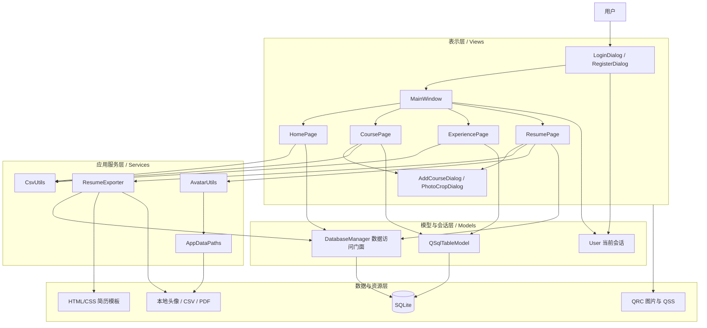
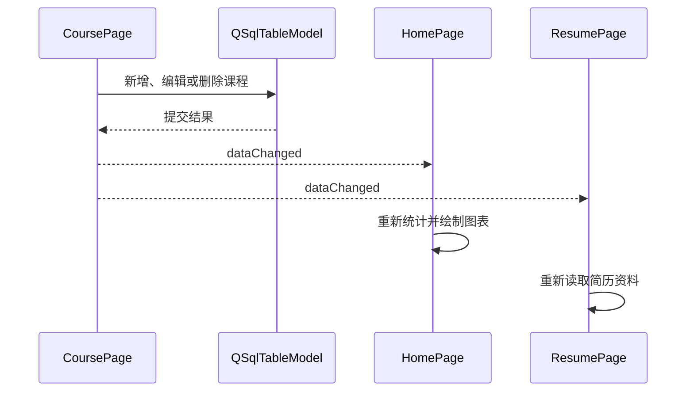
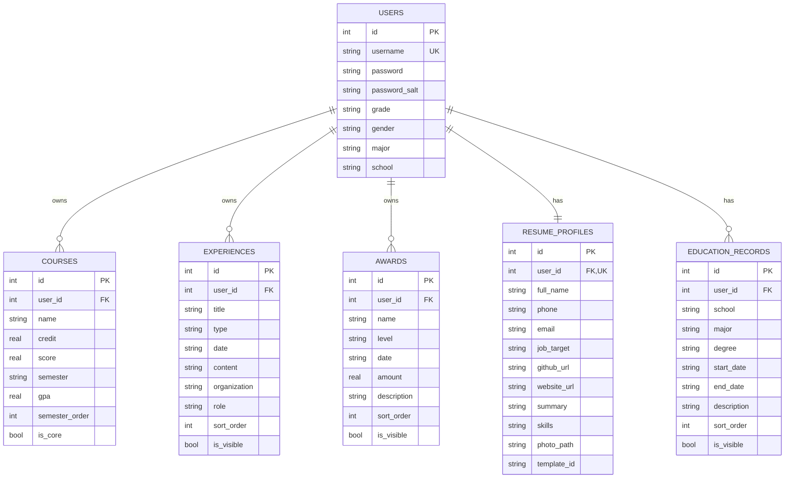
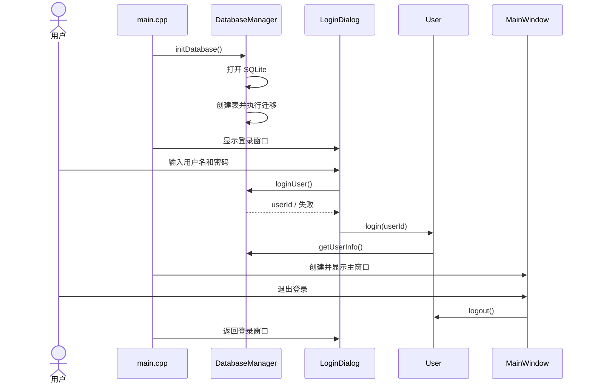
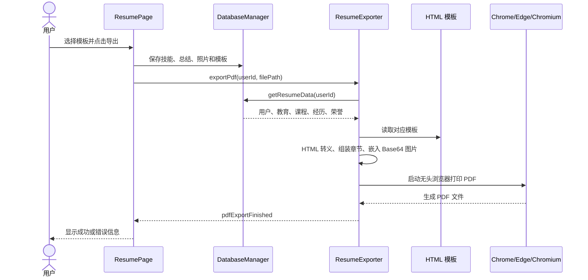
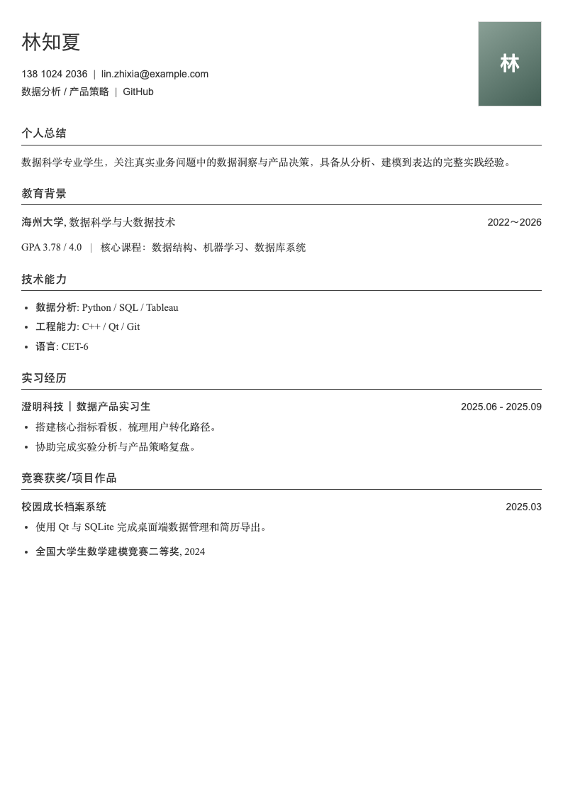
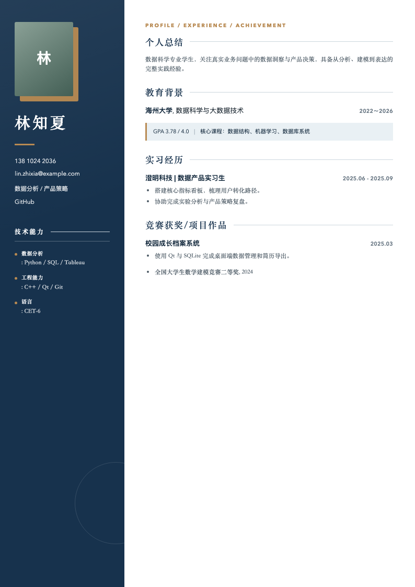
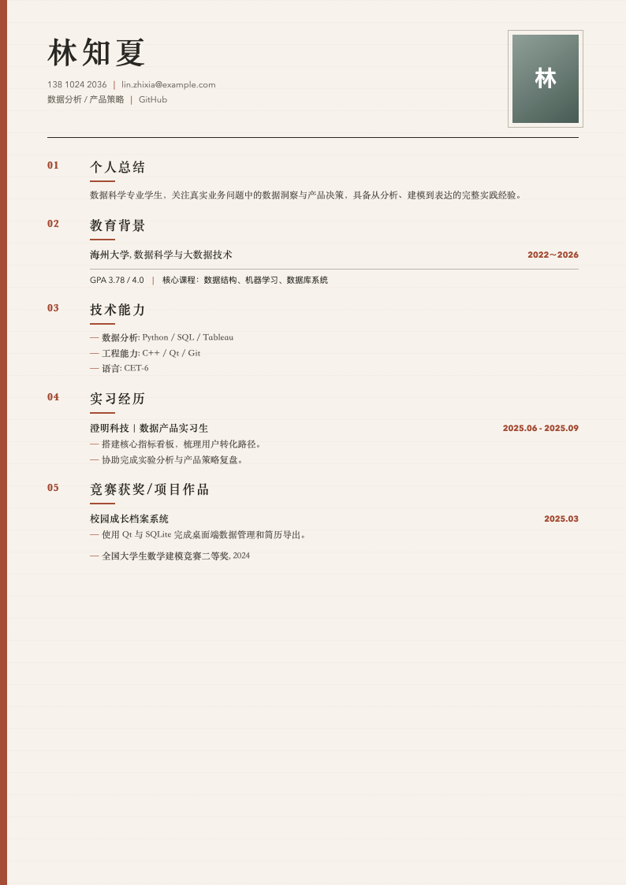
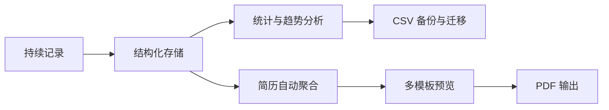

# College Tracker 项目展示说明

---


## 基础功能展示

###  用户系统

- 创建账号；
- 用户名唯一性检查；
- 密码长度和二次确认；（密码已做加密处理）
- 登录失败提示；
- 登录状态加载；
- 退出登录并返回登录页；
- 多账号数据隔离。

###  个人资料

- 学校、年级、性别、专业；
- 入学年份与毕业年份；
- 电话、邮箱、求职方向、个人网站；
- 个人头像；默认头像为一只可爱的哥布林
- 资料更新后同步侧边栏和主教育经历。

### 首页总览

首页集中显示：

- 已修课程数量；
- 加权 GPA；
- 竞赛数量；
- 实习数量；
- 项目数量；
- 荣誉数量；
- 大一上至大四下的 GPA 趋势折线图；
- 全量数据导入与导出入口。

图表使用 `QPainter` 自行绘制，并采用 4 倍高分辨率画布，在高 DPI 屏幕上仍能保持清晰。

### 课程与成绩

- 添加课程；
- 录入学分、成绩和学期；
- 自动预览与保存 GPA；
- 双击表格直接修改；
- 标记简历核心课程；
- 多选删除；
- 清空当前用户课程；
- 按学期顺序显示；
- 课程 CSV 导入导出；
- 自动统计课程数、平均分、GPA 和总学分。

### 经历与荣誉

经历支持：

- 实习；
- 竞赛；
- 项目；
- 其他活动。

荣誉支持：

- 国家级；
- 省级；
- 校级；
- 院级；
- 奖金金额。

两类数据都支持添加、修改、删除、清空、排序和 CSV 导入导出。

### 简历导出

导出页面支持：

*   用户可选择多个模板，并且可以按空格对每种模板进行预览
*   用户可以选择填入技术能力、个人总结用于丰富简历导出
*   用户可以对自己简历现在浏览器预览
*   点击“导出简历”，导出简历为 PDF


## 总体架构设计

### 模块划分

```text
CollegeTracker/
├── src/
│   ├── models/       数据库管理与当前用户会话
│   ├── services/     CSV、头像、路径、简历导出服务
│   ├── views/
│   │   ├── pages/    首页、课程、经历、简历页面
│   │   └── dialogs/  照片裁剪等对话框
│   └── main.cpp      程序入口与登录/主窗口生命周期
├── ui/               Qt Designer 界面文件
├── resources/        全局 QSS 样式
├── templates/        三套简历 HTML 模板
├── assets/           默认头像和模板预览图
```

### 架构风格

项目采用“分层架构 + Qt Model/View + 事件驱动”的设计风格。

当前系统没有为了形式而建立复杂的独立 Controller 对象

用户交互协调主要由 `MainWindow`、各功能页面和 Qt 槽函数完成；

数据访问、导出、文件路径、CSV 和头像处理则下沉到独立模型与服务类中。



### 各层职责

| 层次 | 主要组成 | 职责 |
|---|---|---|
| 表示层 | 各 Dialog、Page、MainWindow | 展示界面、接收输入、反馈操作结果 |
| 应用服务层 | ResumeExporter、CsvUtils、AvatarUtils、AppDataPaths | 承担可复用的业务能力和文件处理 |
| 模型与会话层 | DatabaseManager、User、QSqlTableModel | 数据访问、统计聚合、登录状态、表格模型 |
| 数据与资源层 | SQLite、HTML 模板、QSS、图片、CSV、PDF | 持久化数据和静态资源 |


---

## 设计模式

### 单例模式

项目中有两处设计了典型的单例模式：

- `DatabaseManager`：保证应用只维护一个数据库管理入口；
```c++
static DatabaseManager& getInstance() {
    static DatabaseManager instance;
    return instance;
}
```


- `User`：保证全局只有一个当前登录用户会话。

```c++
static User& getInstance() {
    static User user;
    return user;
}
```

应用价值：

- 统一数据库连接和数据访问；
- 避免重复创建连接；
- 页面能够方便地获取当前用户；
- 通过删除复制构造和赋值运算，防止错误复制。

### 事件驱动风格

课程或经历数据发生变化后，不直接操作其他页面内部控件，而是发送信号，也就是之前学过的事件驱动风格：




### Qt Model/View 模式

项目采用的是一种基于 Qt 特有的 Qt Model/View 机制的“非严格 MVC 模式”。它体现了 MVC 的职责划分，但没有设置独立的 Controller 类。

比如：课程、经历和荣誉页面使用：

- `QSqlTableModel` 作为数据模型；
- `QTableView` 作为数据视图；
- SQLite 作为持久化数据源。

模型负责查询、编辑和提交，视图负责显示和选择。这种设计减少了手工同步表格控件与数据库的代码。

课程页面还通过：

```cpp
m_model->setFilter(QStringLiteral("user_id = %1").arg(userId));
```

实现每个用户只能看到自己的数据。


---

## 数据库详细设计

### 数据库选型

系统选择 SQLite，原因包括：

- 轻量，用户无需额外安装数据库服务；
- 数据库以单文件形式保存在本机；
- 与 Qt SQL 模块结合紧密；
- 适合个人档案类桌面应用；
- 便于备份、迁移和跨平台使用。

### E-R 关系（实体关系图）



### 数据表职责

| 表名 | 作用 |
|---|---|
| `users` | 账户和基本身份信息 |
| `courses` | 课程、成绩、学分、GPA 和核心课程 |
| `experiences` | 实习、竞赛、项目和其他经历 |
| `awards` | 荣誉、级别、日期、奖金和简历描述 |
| `resume_profiles` | 一名用户一份简历基本资料与模板配置 |
| `education_records` | 一名用户可拥有多条教育经历 |

### 数据隔离

系统在多个层面执行用户隔离，各种查表操作都是基于user_id 操作，具体如下：

1. `User` 单例保存当前用户 ID；
2. `QSqlTableModel` 使用 `user_id` 过滤；
3. 删除、更新操作同时校验记录 ID 和用户 ID；
4. 统计、简历和 CSV 导出全部按用户查询。

这保证了同一设备上的不同账号不会混用课程、经历或荣誉数据。


更多数据库的信息，[点我](DATABASE.md) 😋

---

## 关键业务详细设计

### 程序启动与登录流程



程序通过事件循环实现“登录 → 主窗口 → 退出 → 重新登录”，无需重启应用。

### 用户密码加密

项目使用了经典加密算法来保护用户密码 —— SHA-256 哈希盐加密

注册时：

1. 生成 16 字节随机盐值；
2. 将盐值与密码组合；
3. 使用 SHA-256 计算哈希；
4. 分别保存哈希值和盐值。

登录时使用数据库中的盐值重新计算输入密码哈希并比对。

注册时对密码加密代码：

```c++
bool DatabaseManager::registerUser(const QString &username, 
                                   const QString &password,
                                   const QString &grade,
                                   const QString &gender,
                                   const QString &major, 
                                   const QString &school) {
    ...
    // 生成随机盐值
    QByteArray saltBytes(16, Qt::Uninitialized);
    QRandomGenerator::global()->fillRange(reinterpret_cast<quint32 *>(saltBytes.data()),
                                          saltBytes.size() / sizeof(quint32));
    const QString salt = QString::fromLatin1(saltBytes.toHex());
    const QString hashedPassword = hashPassword(password, salt); // *
    ...
}
```

登录时对输入密码进行盐哈希加密后并比对数据库密码：

```c++
int DatabaseManager::loginUser(const QString &username, const QString &password) {
    QSqlQuery query;
    query.prepare("SELECT id, password, password_salt FROM users WHERE username = :username");
    query.bindValue(":username", username);

    if (query.exec() && query.next()) {
        const QString storedHash = query.value(1).toString();
        const QString salt = query.value(2).toString();
        // 对密码进行盐哈希处理，然后对比数据库数据
        const QString inputHash = hashPassword(password, salt);// *
        if (inputHash == storedHash)
            return query.value(0).toInt();
    }
    return -1;
}
```


**该方案避免数据库直接保存明文密码，也能够防止相同密码产生完全相同的存储结果。**


### CSV 导入导出

CSV 能力分为两类：

- 课程、经历、荣誉单独导入导出；
- 首页一键导入导出全部数据。

导入过程包括：

1. 处理 UTF-8 BOM；
2. 识别表头；
3. 解析带逗号、双引号的字段；
4. 校验课程分数、学分、学期、经历类型和荣誉级别；
5. 自动计算 GPA；
6. 逐条记录成功与失败数量；
7. 完成后刷新所有相关页面。

全量 CSV 使用分区格式：

```csv
#SECTION: 课程
课程名称,学分,成绩,学期,核心课程

#SECTION: 经历
标题,类型,时间,描述

#SECTION: 荣誉
奖项名称,荣誉级别,获奖时间,奖金金额
```

导出文件写入 UTF-8 BOM，提升 Excel 对中文编码的识别效果。

**具体的导入导出格式，点我 [CSV_FORMAT](CSV_FORMAT.md) 😋**

### 头像处理

头像功能包含：

- JPG、JPEG、PNG 文件选择；
- 可拖动圆形选区；
- 选区大小调节；
- -180° 至 180° 旋转；
- 左右 90° 快速旋转；
- 高质量缩放和 JPEG 保存；
- 默认头像回退；
- 高分辨率圆形渲染；
- 头像删除和侧边栏同步。

照片最终保存到标准应用数据目录，而不是依赖原图片路径，因此原图片移动或删除后，应用仍可正常使用头像。

### 简历生成与 PDF 导出




>    程序先将数据库数据渲染为本地 HTML，再通过 `QProcess`调用 Chromium 的 `--headless --print-to-pdf`功能，将 HTML 页面打印为 PDF。

导出流程中的工程细节：

- 根据模板 ID 选择对应 HTML；

- 对用户文本执行 HTML 转义，生成用户专属 HTML；

- 用户头像照片转换为 Base64，避免生成结果依赖临时图片路径；

- 用户可以在 Chrome、Edge、Safari 中打开生成的 HTML 文件，对自己的简历进行预览

- 调用浏览器中的无头打印功能，把简历生成的 HTML 转换为 PDF（这个功能并不是依靠 Qt 的，而是需要用户主机上含有一款主流浏览器！！！） 

- 异步检验结果
    `QProcess`不会阻塞主界面。程序监听浏览器的结束信号：

    ```c++
    connect(process, &QProcess::finished, ...);
    ```

    同时每 250 毫秒检测一次目标 PDF：

    ```c++
    if (output.exists() && output.size() > 0) {
        process->terminate();
    }
    ```

    当完成之后，浏览器发出信号，返回导出结果

- 30 秒超时保护：超时后会结束浏览器进程、删除不完整文件并提示用户

- 自动清理临时目录；


## 创新与拓展功能

### 多模板简历系统

系统内置三种视觉风格，可根据申请方向切换：

| 经典学术 | 深海蓝双栏 | 暖色编辑风 |
|---|---|---|
|  |  |  |
| 适合通用申请和学术材料 | 适合技术岗和项目型简历 | 适合商科、研究和综合岗位 |

**用户可点击卡片切换模板，也可按空格进入大图预览。**

**我们预留了 HTML 接口，以便后续扩展继续添加模版，具体的模板 HTML 标准和 API 食用教程，点我 [RESUME_EXPORT.md](RESUME_EXPORT.md) 😋**


### 跨平台工程化

- CMake 统一构建；
- Qt Resource 嵌入模板、图片和样式；
- Windows 使用 `windeployqt` 打包依赖；
- Linux 使用 `linuxdeploy` 构建 AppImage；
- 数据存储使用 `QStandardPaths` 适配不同操作系统；
- PDF 导出自动搜索各平台可用的 Chromium 浏览器。


---

## 系统实现与运行效果

### 视觉设计

系统采用暖象牙白与深绿色为主色：

- 浅色固定主题，避免系统深色模式造成显示异常；
- 卡片式布局和轻量阴影增强层级；
- 侧边栏提供稳定导航；
- 主操作、次操作、危险操作使用不同按钮语义和颜色；
- 表格使用交替行色、隐藏技术字段和整行选择；
- 登录、注册、课程录入、头像裁剪均使用独立对话框；
- ~~**默认哥布林头像和文案增强产品辨识度**。~~ (🧌)


### **运行稳定性处理**

- 删除和清空操作需要二次确认；
- 日期输入禁止选择未来时间；
- 成绩范围限制为 0–100；
- 学分必须大于 0；
- 入学年份不能晚于毕业年份；
- 数据写入失败时回滚或恢复模型；
- PDF 导出失败、超时、浏览器缺失均有明确提示；
- 图片读取失败和目录创建失败均有错误反馈；
- 页面显示和窗口尺寸变化时重新绘制图表。


---

## 项目过程管理规范

### Git 版本管理

项目使用 Git 保存完整开发历史。当前仓库包含 60 次提交，并采用功能分支推进不同模块：

- `develop-ui-test`：界面优化与首页功能；
- `import-export-and-merge-nav`：CSV 和导航整合；
- `develop-export-resume`：简历导出；
- `feature/user-profile-and-avatar`：用户资料与头像；
- `optimize-ui`、`warm-ivory-redesign`：视觉设计；
- `reconstruct-mainwindow-tokey`：主窗口重构。

主要功能通过合并提交进入主分支，例如：

- 合并 CSV 导入导出功能；
- 合并 UI 优化和首页修复；
- 合并简历导出、资料编辑和头像功能；
- 合并登录退出循环功能。

这种方式使不同功能能够相对独立开发，并保留清晰的演进记录。

### 构建规范

- 使用 CMake 管理工程；
- 启用 `AUTOUIC`、`AUTOMOC`、`AUTORCC`；
- 使用 C++17；
- 统一维护源文件列表；
- 资源通过 `resources.qrc` 嵌入；
- 使用标准安装规则支持打包；
- Linux 环境中严格处理文件名大小写。

### 文档规范

仓库已有：

- `README.md`：项目定位和基本介绍；
- `CSV_FORMAT.md`：CSV 表头、字段、示例和常见问题；
- `DATABASE.md`：项目数据库结构、关系、迁移和接口说明；
- `RESUME_EXPORT.md`：简历导出机制与新增模板维护说明；
- 本文档：项目展示与答辩材料。

### 仓库卫生

`.gitignore` 排除了：

- 编译产物；
- IDE 配置；
- 系统临时文件；
- 本地数据库；
- 用户 CSV 数据；
- 缓存和生成文件。

同时保留 `temp_data/` 中的共享示例数据，便于演示和测试。

---

## 项目质量与工程亮点

### 安全性

- 密码加盐哈希；
- SQL 参数绑定；
- 用户级数据过滤；
- 删除操作附带用户 ID 条件；
- 本地隐私数据不进入安装包；
- 相对照片路径防止目录穿越。

### 可靠性

- 注册、个人资料同步等复合操作使用事务；
- 批量删除课程使用事务；
- 模型提交失败时回滚；
- 数据库开启外键约束；
- PDF 导出包含错误、进程和超时处理。

### 兼容性

- 自动迁移旧数据；
- 兼容旧版四列课程 CSV；
- 处理 UTF-8 BOM；
- 处理 CSV 中的逗号、引号和换行；
- 兼容旧头像格式；
- 数据目录适配 Windows、Linux、macOS。

---


## 13. 现场展示建议

### 13.1 推荐演示顺序

#### 第一部分：问题与定位（约 1 分钟）

1. 说明大学数据分散的问题；
2. 给出“记录—分析—输出”的产品闭环；
3. 简要介绍技术栈和本地优先特点。

#### 第二部分：系统架构（约 2 分钟）

1. 展示分层架构图；
2. 说明页面层、服务层、模型层和 SQLite；
3. 重点介绍单例、Model/View、信号槽和门面模式。

#### 第三部分：基础功能运行（约 3 分钟）

1. 登录系统；
2. 新增一门课程并观察 GPA 自动计算；
3. 返回首页观察统计和折线图刷新；
4. 添加一条项目经历和一项荣誉；
5. 演示 CSV 一键导出。

#### 第四部分：创新功能（约 2 分钟）

1. 编辑个人资料和头像；
2. 展示头像裁剪、拖动和旋转；
3. 切换三套简历模板；
4. 按空格放大模板；
5. 在浏览器预览并导出 PDF。

#### 第五部分：工程管理与总结（约 1 分钟）

1. 展示 Git 分支和提交历史；
2. 展示 Windows/Linux 自动打包；
3. 总结项目的实际价值和后续规划。


---

## 14. 可能的答辩问题

### Q2：为什么选择 SQLite？

SQLite 无需服务器、部署简单、跨平台，足以支撑个人成长档案的数据规模，并且能够通过 Qt SQL 直接绑定表格模型。

### Q3：如何保证不同用户的数据不会混在一起？

所有业务表都有 `user_id` 外键。页面模型、统计查询、更新、删除、导入、导出和简历生成全部按当前用户 ID 过滤。

### **Q4：系统如何保证修改课程后首页和简历立即更新？**

**课程页和经历页在数据变化后发出信号，首页和简历页通过槽函数重新查询数据，实现松耦合的自动刷新。**

### Q5：为什么 PDF 导出使用浏览器？

HTML/CSS 在排版和模板扩展方面成熟，Chromium 的打印引擎能够稳定生成高质量 PDF，同时便于继续增加新模板。

### **Q6：数据库结构升级后，旧数据怎么办？**

**启动时执行自动迁移：检测字段、补充列、迁移旧简历资料、初始化教育经历、迁移密码并修复历史不一致。**

### Q8：项目是否具备继续开发的基础？

具备。页面已模块化，服务能力已拆分，数据库有迁移机制，简历模板可扩展，构建和打包有自动化流程。

---

## 15. 当前不足与后续规划

### 15.1 当前不足

- 目前缺少完整的自动化单元测试和界面回归测试；
- 密码方案可进一步升级为 PBKDF2、scrypt 或 Argon2；
- PDF 导出依赖本机 Chrome、Edge 或 Chromium；
- 页面层仍承担部分业务协调逻辑，可继续下沉到控制器或应用服务；
- 教育经历和简历条目排序、显示控制的后端接口已具备，但前端管理能力仍可继续完善；
- 数据分析目前以 GPA 和数量统计为主，维度仍可扩展。

### 15.2 后续规划

1. 增加课程分类、排名和学分完成度；
2. 增加目标 GPA 模拟计算；
3. 增加学期报告和年度成长报告；
4. 增加完整教育经历管理界面；
5. 增加简历条目拖拽排序和显示开关；
6. 增加更多简历模板和自定义主题；
7. 增加 PDF 内置导出方案，降低外部浏览器依赖；
8. 增加数据库加密和备份恢复；
9. 增加 Qt Test 单元测试与 GitHub Actions 自动测试；
10. 在保持隐私的前提下提供可选的加密云同步。

---

## 16. 项目总结

College Tracker 已经完成了从基础 CRUD 到完整产品闭环的演进：

- 在功能上，覆盖课程、成绩、经历、荣誉、统计、导入导出和简历；
- 在架构上，实现页面、服务、模型、数据和资源的分层；
- 在设计上，应用单例、Model/View、观察者、门面和委托等模式；
- 在数据上，具备外键、索引、事务、用户隔离和自动迁移；
- 在体验上，具备统一视觉、数据联动、模板预览和头像处理；
- 在工程上，具备 Git 分支协作、文档、跨平台构建和自动打包；
- 在价值上，将日常大学生活记录转化为可分析、可迁移、可输出的个人成长资产。

最终，项目形成了一条清晰的价值链：



> 项目的核心不是“保存几张表”，而是帮助学生把大学期间发生过的事情，持续整理成能够理解自己、证明自己并服务未来选择的数据。
