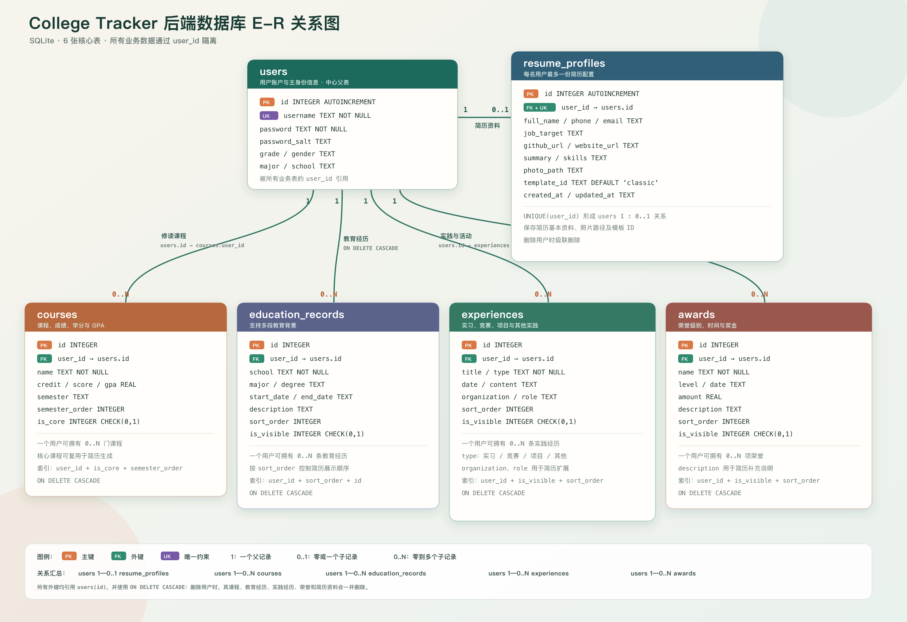

# College Tracker 数据库关系说明

## 表关系汇总

| 父表 | 子表 | 基数关系 | 外键 | 说明 |
|---|---|---|---|---|
| `users` | `resume_profiles` | `1 : 0..1` | `resume_profiles.user_id → users.id` | `user_id` 具有唯一约束，每名用户最多一份简历资料 |
| `users` | `courses` | `1 : 0..N` | `courses.user_id → users.id` | 一名用户可以保存多门课程 |
| `users` | `education_records` | `1 : 0..N` | `education_records.user_id → users.id` | 一名用户可以保存多段教育经历 |
| `users` | `experiences` | `1 : 0..N` | `experiences.user_id → users.id` | 一名用户可以保存多条实习、竞赛或项目经历 |
| `users` | `awards` | `1 : 0..N` | `awards.user_id → users.id` | 一名用户可以保存多项荣誉 |

所有外键关系均使用 `ON DELETE CASCADE`。删除用户记录时，该用户关联的课程、教育经历、实践经历、荣誉和简历资料会自动删除。

## 设计要点

- `users` 是整个数据库的中心父表。
- 所有业务数据通过 `user_id` 实现多用户隔离。
- `resume_profiles.user_id` 同时具有外键和唯一约束，因此形成一对一关系。
- `courses.is_core` 决定课程是否作为核心课程进入简历。
- `experiences`、`awards` 和 `education_records` 使用 `sort_order` 与 `is_visible` 控制简历展示。
- 数据表之间不直接交叉引用；简历生成时由 `DatabaseManager::getResumeData()` 按用户聚合各表数据。
