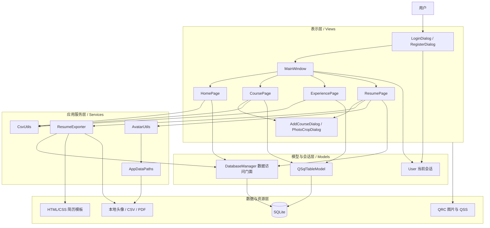
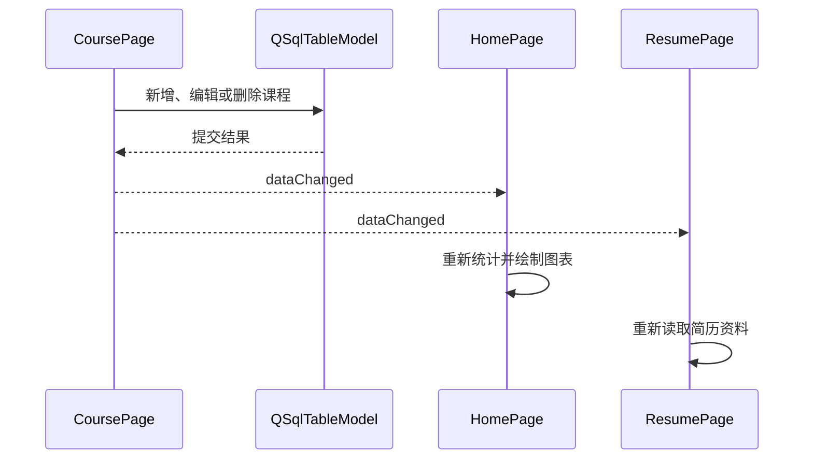
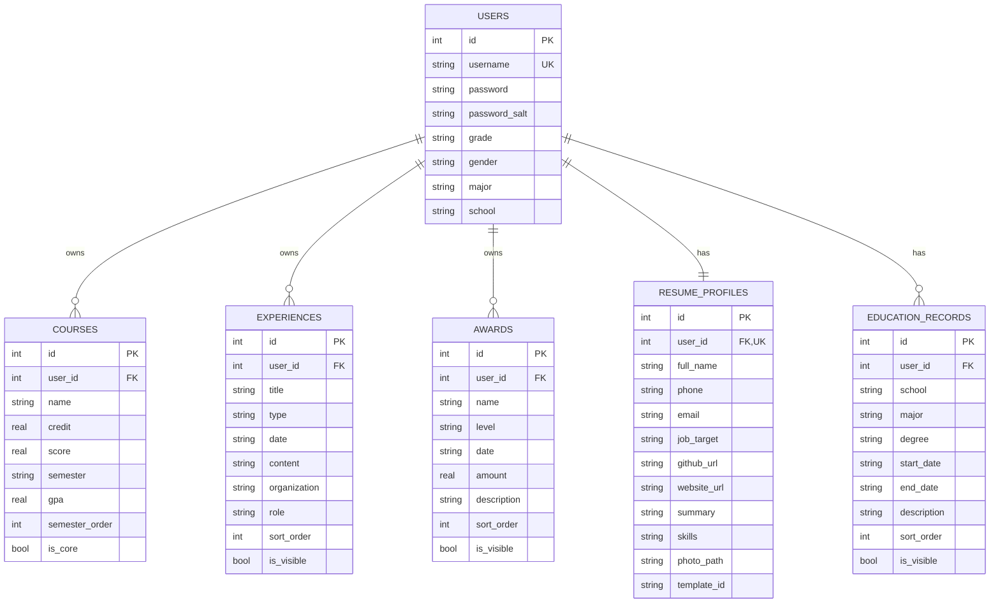
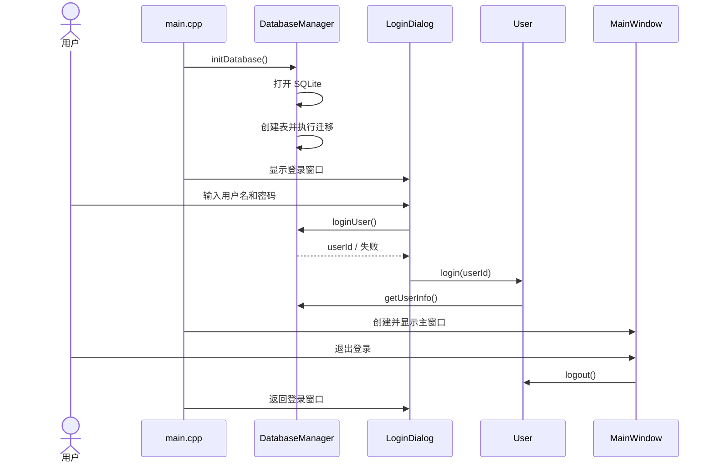
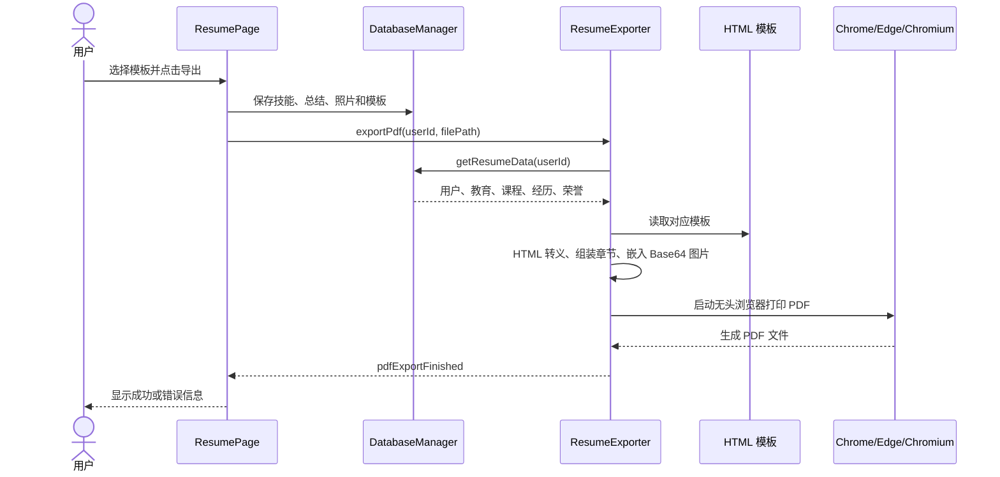

# SHOWCASE 


## 基础功能展示

###  用户系统

- 创建账号；
- 用户名唯一性检查；
- 密码长度和二次确认；（密码已做加密处理）
- 登录失败提示；
- 登录状态加载；
- 退出登录并返回登录页；
- 多账号数据隔离。

###  个人资料

- 学校、年级、性别、专业；
- 入学年份与毕业年份；
- 电话、邮箱、求职方向、个人网站；
- 个人头像；默认头像为一只可爱的哥布林
- 资料更新后同步侧边栏和主教育经历。

### 首页总览

首页集中显示：

- 已修课程数量；
- 加权 GPA；
- 竞赛数量；
- 实习数量；
- 项目数量；
- 荣誉数量；
- 大一上至大四下的 GPA 趋势折线图；
- 全量数据导入与导出入口。

图表使用 `QPainter` 自行绘制，并采用 4 倍高分辨率画布，在高 DPI 屏幕上仍能保持清晰。

### 课程与成绩

- 添加课程；
- 录入学分、成绩和学期；
- 自动预览与保存 GPA；
- 双击表格直接修改；
- 标记简历核心课程；
- 多选删除；
- 清空当前用户课程；
- 按学期顺序显示；
- 课程 CSV 导入导出；
- 自动统计课程数、平均分、GPA 和总学分。

### 经历与荣誉

经历支持：

- 实习；
- 竞赛；
- 项目；
- 其他活动。

荣誉支持：

- 国家级；
- 省级；
- 校级；
- 院级；
- 奖金金额。

两类数据都支持添加、修改、删除、清空、排序和 CSV 导入导出。

### 简历导出

导出页面支持：

*   用户可选择多个模板，并且可以按空格对每种模板进行预览
*   用户可以选择填入技术能力、个人总结用于丰富简历导出
*   用户可以对自己简历现在浏览器预览
*   点击“导出简历”，导出简历为 PDF


## 总体架构设计

### 模块划分

```text
CollegeTracker/
├── src/
│   ├── models/       数据库管理与当前用户会话
│   ├── services/     CSV、头像、路径、简历导出服务
│   ├── views/		  视图
│   │   ├── pages/    	首页、课程、经历、简历页面
│   │   └── dialogs/  	照片裁剪等对话框
│   └── main.cpp      程序入口与登录/主窗口生命周期
├── ui/               Qt Designer 界面文件
├── resources/        全局 QSS 样式
├── templates/        三套简历 HTML 模板
├── assets/           默认头像和模板预览图
```


### 架构风格

项目采用“分层架构 + Qt Model/View + 事件驱动”的设计风格。

用户交互协调主要由 `MainWindow`、各功能页面和 Qt 槽函数完成；

数据访问、导出、文件路径、CSV 和头像处理则下沉到独立模型与服务类中。



### 各层职责

| 层次 | 主要组成 | 职责 |
|---|---|---|
| 表示层 | 各 Dialog、Page、MainWindow | 展示界面、接收输入、反馈操作结果 |
| 应用服务层 | ResumeExporter、CsvUtils、AvatarUtils、AppDataPaths | 承担可复用的业务能力和文件处理 |
| 模型与会话层 | DatabaseManager、User、QSqlTableModel | 数据访问、统计聚合、登录状态、表格模型 |
| 数据与资源层 | SQLite、HTML 模板、QSS、图片、CSV、PDF | 持久化数据和静态资源 |

**这么模块化设计方便了后续维护**


---

## 设计模式

### 单例模式

项目中有两处设计了典型的单例模式：

- `DatabaseManager`：保证应用只维护一个数据库管理入口；
```c++
static DatabaseManager& getInstance() {
    static DatabaseManager instance;
    return instance;
}
```


- `User`：保证全局只有一个当前登录用户会话。

```c++
static User& getInstance() {
    static User user;
    return user;
}
```


### 事件驱动风格

课程或经历数据发生变化后，不直接操作其他页面内部控件，而是发送信号，也就是之前学过的事件驱动风格：




### Qt Model/View 架构

项目采用的是一种基于 Qt 特有的 MVD 架构。

比如：课程、经历和荣誉页面使用：

- `QSqlTableModel` 作为数据模型；

    >   -   在这个项目中，使用了 Qt 提供的 `QSqlTableModel` 类作为数据模型。
    >   -   模型被直接绑定到了数据库中的 `courses` 表，并通过 `m_model->setFilter(...)` 实现每个用户只能看到自己的数据
    >   -   底层的数据库交互和数据处理逻辑则由 `DatabaseManager` 单例来负责维护。

- `QTableView` 作为数据视图；

-  `CoursePage.cpp` 中，定义了一个名为 `CoreCourseDelegate` 的类，它继承自底层的 `QStyledItemDelegate`。这个委托被专门应用在了第 8 列（即“核心课程”列）上：

    ```c++
    m_tableView->setItemDelegateForColumn(8, new CoreCourseDelegate(m_tableView))
    ```


---


## 数据库详细设计

### 数据库选型

系统选择 SQLite，原因包括：

- 轻量，用户无需额外安装数据库服务；
- 数据库以单文件形式保存在本机；
- 与 Qt SQL 模块结合紧密；
- 适合个人档案类桌面应用；
- 便于备份、迁移和跨平台使用。


### E-R 关系（实体关系图）



### 数据表职责

| 表名 | 作用 |
|---|---|
| `users` | 账户和基本身份信息 |
| `courses` | 课程、成绩、学分、GPA 和核心课程 |
| `experiences` | 实习、竞赛、项目和其他经历 |
| `awards` | 荣誉、级别、日期、奖金和简历描述 |
| `resume_profiles` | 一名用户一份简历基本资料与模板配置 xx |
| `education_records` | 一名用户可拥有多条教育经历 |


### 数据隔离

系统在多个层面执行用户隔离，各种查表操作都是基于user_id 操作,这保证了同一设备上的不同账号不会混用课程、经历或荣誉数据。


更多数据库的信息，[点我](DATABASE.md) 😋


---

## 关键业务详细设计


### 程序启动与登录流程



程序通过事件循环实现“登录 → 主窗口 → 退出 → 重新登录”，无需重启应用。


### 用户密码加密

项目使用了经典加密算法来保护用户密码 —— SHA-256 哈希盐加密

注册时通过加密算法写入数据库，登录时使用数据库中的盐值重新计算输入密码哈希并比对。

注册时对密码加密代码：

```c++
bool DatabaseManager::registerUser(const QString &username, 
                                   const QString &password,
                                   const QString &grade,
                                   const QString &gender,
                                   const QString &major, 
                                   const QString &school) {
    ...
    // 生成随机盐值
    QByteArray saltBytes(16, Qt::Uninitialized);
    QRandomGenerator::global()->fillRange(reinterpret_cast<quint32 *>(saltBytes.data()),
                                          saltBytes.size() / sizeof(quint32));
    const QString salt = QString::fromLatin1(saltBytes.toHex());
    const QString hashedPassword = hashPassword(password, salt); // *
    ...
}
```

登录时对输入密码进行盐哈希加密后并比对数据库密码：

```c++
int DatabaseManager::loginUser(const QString &username, const QString &password) {
    QSqlQuery query;
    query.prepare("SELECT id, password, password_salt FROM users WHERE username = :username");
    query.bindValue(":username", username);

    if (query.exec() && query.next()) {
        const QString storedHash = query.value(1).toString();
        const QString salt = query.value(2).toString();
        // 对密码进行盐哈希处理，然后对比数据库数据
        const QString inputHash = hashPassword(password, salt);// *
        if (inputHash == storedHash)
            return query.value(0).toInt();
    }
    return -1;
}
```


**该方案避免数据库直接保存明文密码，也能够防止相同密码产生完全相同的存储结果。** ~~（但其实没什么用，因为就算加密了密码，也能直接在本地直接打开数据库）~~ (本机路径：<u>*~/Library/Application\ Support/CollegeTracker/CollegeTracker/college_tracker.db*</u>)


### CSV 导入导出

CSV 能力分为两类：

- 课程、经历、荣誉单独导入导出；
- 首页一键导入导出全部数据。

全量 CSV 使用分区格式：

```csv
#SECTION: 课程
课程名称,学分,成绩,学期,核心课程

#SECTION: 经历
标题,类型,时间,描述

#SECTION: 荣誉
奖项名称,荣誉级别,获奖时间,奖金金额
```

导出文件写入 UTF-8 BOM，提升 Excel 对中文编码的识别效果。

**具体的导入导出格式，点我 [CSV_FORMAT](CSV_FORMAT.md) 😋**


### 头像处理

头像功能包含：

- JPG、JPEG、PNG 文件选择；
- 可拖动圆形选区；
- 选区大小调节；
- -180° 至 180° 旋转；
- 左右 90° 快速旋转；
- 高质量缩放和 JPEG 保存；
- 默认头像回退；
- 高分辨率圆形渲染；
- 头像删除和侧边栏同步。

照片最终保存到标准应用数据目录，而不是依赖原图片路径，因此原图片移动或删除后，应用仍可正常使用头像。


### 简历生成与 PDF 导出




>    程序先将数据库数据渲染为本地 HTML，再通过 `QProcess`调用 Chromium 的 `--headless --print-to-pdf`功能，将 HTML 页面打印为 PDF。


## 创新与拓展功能

### 多模板简历系统

系统内置三种视觉风格，可根据申请方向切换：

| 经典学术 | 深海蓝双栏 | 暖色编辑风 |
|---|---|---|
|  |  |  |
| 适合通用申请和学术材料 | 适合技术岗和项目型简历 | 适合商科、研究和综合岗位 |

**用户可点击卡片切换模板，也可按空格进入大图预览。**

**我们预留了 HTML 接口，以便后续扩展继续添加模版，具体的模板 HTML 标准和 API 食用教程，点我 [RESUME_EXPORT.md](RESUME_EXPORT.md) 😋**

（可扩展性）


---

## 系统实现与运行效果


### **运行稳定性处理**

- 删除和清空操作需要二次确认；
- 导入 CSV 时格式错误会自动检测并提示用户
- 日期输入禁止选择未来时间；
- 成绩范围限制为 0–100；
- 学分必须大于 0；
- 入学年份不能晚于毕业年份；
- 数据写入失败时回滚或恢复模型；
- PDF 导出失败、超时、浏览器缺失均有明确提示；
- 图片读取失败和目录创建失败均有错误反馈；
- 页面显示和窗口尺寸变化时重新绘制图表。


### 可扩展性

1.  **可扩展的简历模板注册机制**：

    项目引入了 `ResumeTemplateRegistry`（模板注册中心），并将具体的主题样式抽离为了独立的 HTML 模板。这意味着当用户需要更多个性化的简历样式时，开发人员完全不需要修改 C++ 业务代码只需编写一套新的 HTML/CSS 模板并将其注册到系统中，即可瞬间获得全新的动态简历主题。

2.  **预留了部分接口**：

    预留了 `getEducationRecords`、`addEducationRecord`（教育经历管理）等接口，并注明了“留了接口并实现了，但是还没有实际应用”。如果后续要添加新增教育经理的功能，开发者可以直接调用这个接口管理教育经理，方便了后续开发。


---

## 项目过程管理规范

### Git 版本管理


项目使用 Git 保存完整开发历史，并且使用 github 远程托管代码 ([仓库点我😙](https://github.com/TokeyTuT/CollegeTracker))。当前仓库包含 60+ 提交，并采用功能分支推进不同模块：

- `develop-ui-test`：界面优化与首页功能；
- `import-export-and-merge-nav`：CSV 和导航整合；
- `develop-export-resume`：简历导出；
- `feature/user-profile-and-avatar`：用户资料与头像；
- `optimize-ui`、`warm-ivory-redesign`：视觉设计；
- `reconstruct-mainwindow-tokey`：主窗口重构。


### 文档规范

仓库已有：

- `README.md`：项目定位和基本介绍；
- `CSV_FORMAT.md`：CSV 表头、字段、示例和常见问题；
- `DATABASE.md`：项目数据库结构、关系、迁移和接口说明；
- `RESUME_EXPORT.md`：简历导出机制与新增模板维护说明；


### 打包工作流

项目采用了 Github Action 功能，构建了一套 Linux、macOS、Windows 的自动化打包流，使得开发者在每次提交之后都能够自动打包成三个系统的可执行文件。

具体打包描述文件，[点我😋](https://github.com/TokeyTuT/CollegeTracker/tree/main/.github/workflows)


